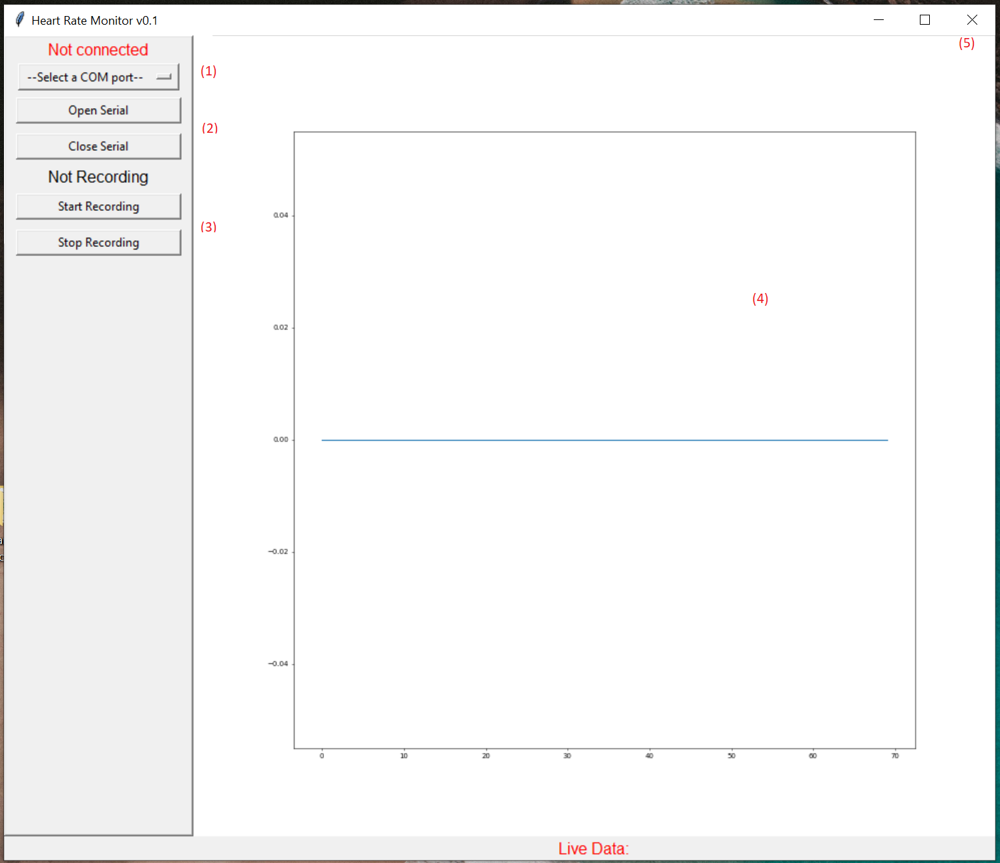

# Electrocardiography (ECG) laboratory

## Computer set up

1. Check that Python 3.9 is installed, otherwise install it depending on your OS.

2. Download the next files:

* [python_code.py](labs\ECG\python_code.py)
* [arduino_code.ino](labs\ECG\arduino_code.ino)

3. Open a terminal inside this folder and run:

```
python3.9 -m venv .venv
```
And a virtual environment have been created (a folder called ".venv" inside this folder)

4. In the same terminal activate the environment running:

If you have Windows:
```
source .venv/Scripts/activate
```

If you have Linux or MacOS:
```
source .venv/bin/activate
```

And now the environment must been activated (check for "*(.venv)*" that appears all the time in the terminal)

5. In the terminal run:

```
pip install -r requirements.txt
```

6. Now run:

```
python python_code.py
```
And the interface must appear!


## Board and Arduino set up

1. Flash the arduino_code.ino to your arduino

2. Connect each pin like this diagram:


## Participant set up

1. Prepare each electrode position skin with alcohol

2.  Connect electrodes like this diagram (following colors):


## Interface
* <font color="red">Not connected</font>: Check if there is a device connected
* **--Select a COM port--**: Select the COM port the Arduino is using (where the USB of Arduino is connected). Look in device manager under ports for more information. (1)
* **Open Serial**: Start monitoring data from Arduino (2) and the signal appears in the graph
* **Close Serial**: Stop monitoring data from Arduino (2) and the signal stops appearing in the graph
* **Not recording**: Message showing if the data is being saved or not (3)
* **Start Recording**: Start recording data (3)
* **Stop Recording**: Stop recording data (3) and saving it as an excel file.
* **Live graph** (4) of incoming raw unfiltered data.




## References

Thanks to [ChrisDavi3s](https://github.com/ChrisDavi3s/ArduinoAD8232ECG?tab=readme-ov-file#installation) because main parts of this repo is based on his ArduinoAD8232ECG project.